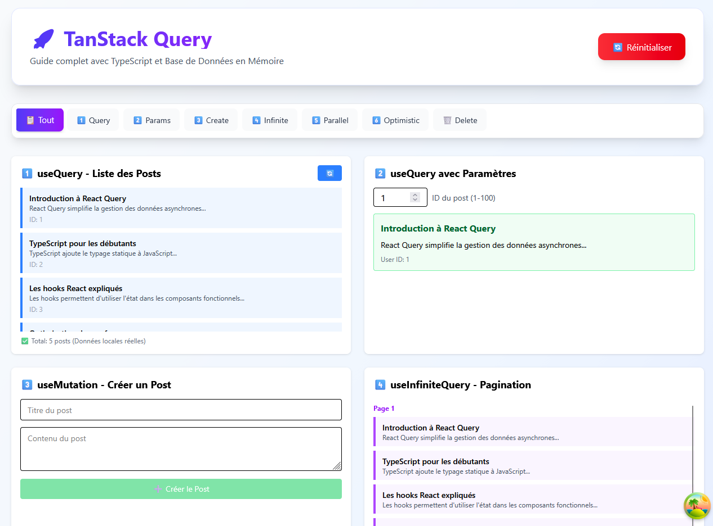
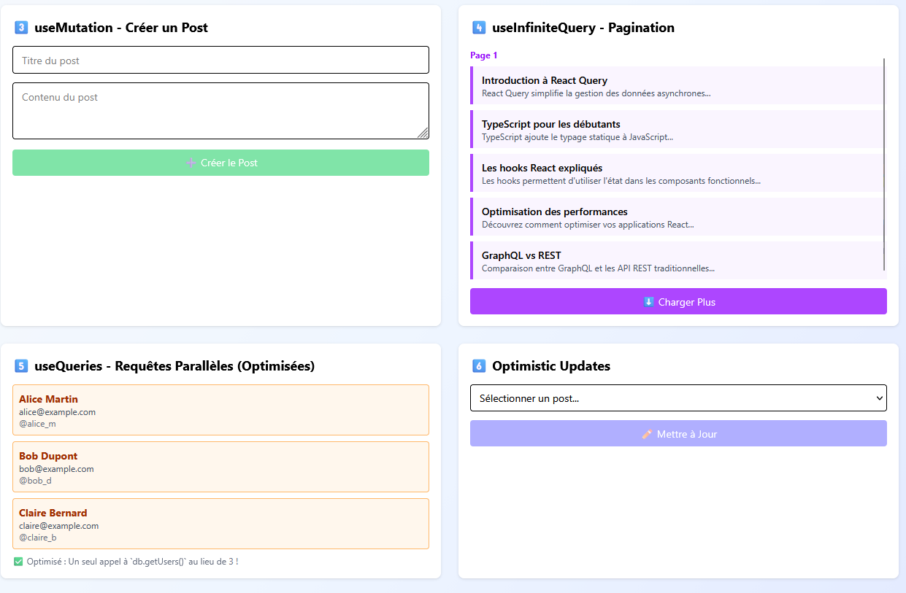
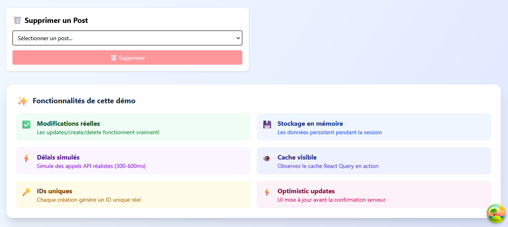

# 🚀 TanStack Query Demo

## Description

**TanStack Query Demo** est une application React avec **TypeScript** qui illustre l’utilisation avancée de **React Query** pour la gestion de données asynchrones.

L’application permet :

- De créer, lire, mettre à jour et supprimer des posts.
- D’observer le cache en temps réel et les optimisations de React Query.
- De simuler une base de données en mémoire avec des délais réalistes (300-600ms).
- D’utiliser des IDs uniques et séquentiels pour chaque post.

---

## Fonctionnalités principales

### Tabs interactifs

- `📋 Tout` : affiche toutes les démonstrations.
- `1️⃣ Query` : requêtes basiques.
- `2️⃣ Params` : requêtes avec paramètres.
- `3️⃣ Create` : création de posts via `useMutation`.
- `4️⃣ Infinite` : pagination infinie.
- `5️⃣ Parallel` : requêtes parallèles.
- `6️⃣ Optimistic` : mises à jour optimistes.
- `🗑️ Delete` : suppression de posts.

### Gestion du cache

- Les données sont mises à jour automatiquement après chaque mutation grâce à `queryClient.invalidateQueries`.
- Possibilité de réinitialiser toutes les données avec le bouton **Réinitialiser**.

### UI/UX moderne

- Design avec **Tailwind CSS**, cartes et grid responsive.
- Footer interactif présentant toutes les fonctionnalités.
- Support pour observateur de cache via **React Query Devtools**.

---

## Technologies utilisées

- **React 18+**
- **TypeScript**
- **React Query (TanStack Query)**
- **Tailwind CSS**
- Base de données **locale en mémoire** simulant des appels API.

## Aperçu de l’application

### Page principale avec Tabs

### Autres parties

