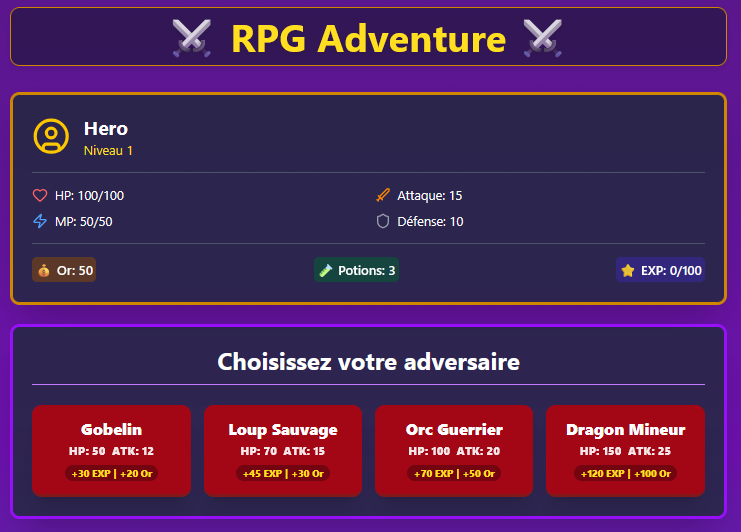
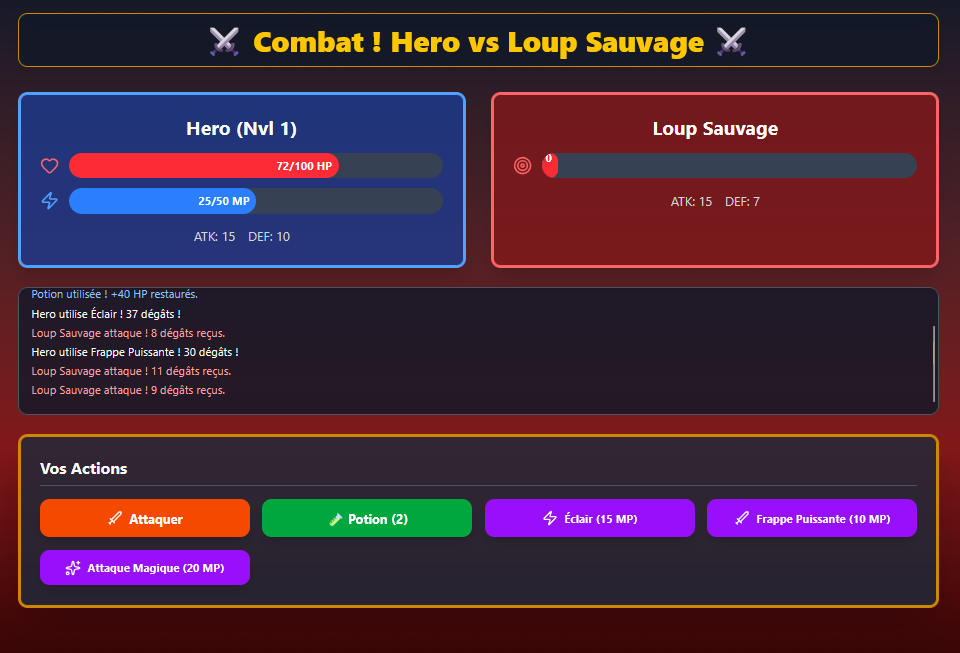

# ⚔️ RPG Battle Game - React + Redux Toolkit + TypeScript

Un mini jeu RPG au tour par tour développé avec **React**, **TypeScript** et **Redux Toolkit**, permettant d’affronter des ennemis, d’utiliser des compétences, des potions et de faire progresser son héros à travers un système d’expérience et de niveaux.  

---

## 🧩 Fonctionnalités principales

- 👤 **Système de joueur complet** : HP, MP, Attaque, Défense, Niveau, EXP, Or, Potions  
- 🧟 **Gestion des ennemis** : attaque, défense, récompenses EXP/Or  
- ⚔️ **Combat au tour par tour** avec journal des actions (log)  
- 🪄 **Utilisation de compétences spéciales** avec coût en MP  
- 🧴 **Utilisation de potions** pour restaurer les HP  
- 🏆 **Système de victoire / défaite** avec montée de niveau automatique  
- 💾 **Gestion d’état globale** via Redux Toolkit  
- 🎨 **Interface moderne** (React + TailwindCSS) avec icônes Lucide  

---

## 🛠️ Stack Technique

| Technologie | Description |
|--------------|-------------|
| **React** | Framework UI pour construire l’interface du jeu |
| **TypeScript** | Typage statique pour la sécurité du code |
| **Redux Toolkit** | Gestion d’état globale simplifiée et puissante |
| **React-Redux** | Intégration entre React et Redux |
| **TailwindCSS** | Framework CSS utilitaire pour le design |
| **Lucide-React** | Icônes vectorielles modernes |
| **Vite** | Build tool ultra rapide pour React |

---

## 📸 Aperçu de l’application

### 🏠 Écran du Menu principal
<p align="center">
  
</p>

### ⚔️ Écran du Combat
<p align="center">
  
</p>

## 📁 Structure du projet

```bash
src/
│
├─ store/
│  ├─ slices/
│  │  └─ gameSlice.ts        # Logique du jeu (reducers Redux)
│  └─ store.ts               # Configuration du store Redux
│
├─ types/
│  └─ gameTypes.ts           # Interfaces TypeScript : Player, Enemy, etc.
│
├─ constants/
│  └─ data.ts                # Données statiques : ennemis, compétences...
│
├─ components/
│  ├─ PlayerStats.tsx        # Affichage des stats du joueur
│  ├─ EnemyStats.tsx         # Affichage des stats de l'ennemi
│  ├─ BattleLog.tsx          # Journal des actions
│  ├─ ActionButtons.tsx      # Boutons d’action du joueur
│  └─ VictoireCard.tsx       # Victoire card
│
├─ screens/
│  ├─ MenuScreen.tsx         # Menu principal
│  └─ BattleScreen.tsx       # Écran de combat
│  └─ GameScreen.tsx         # L’écran principal du jeu
└─ App.tsx                   # Point d’entrée principal

